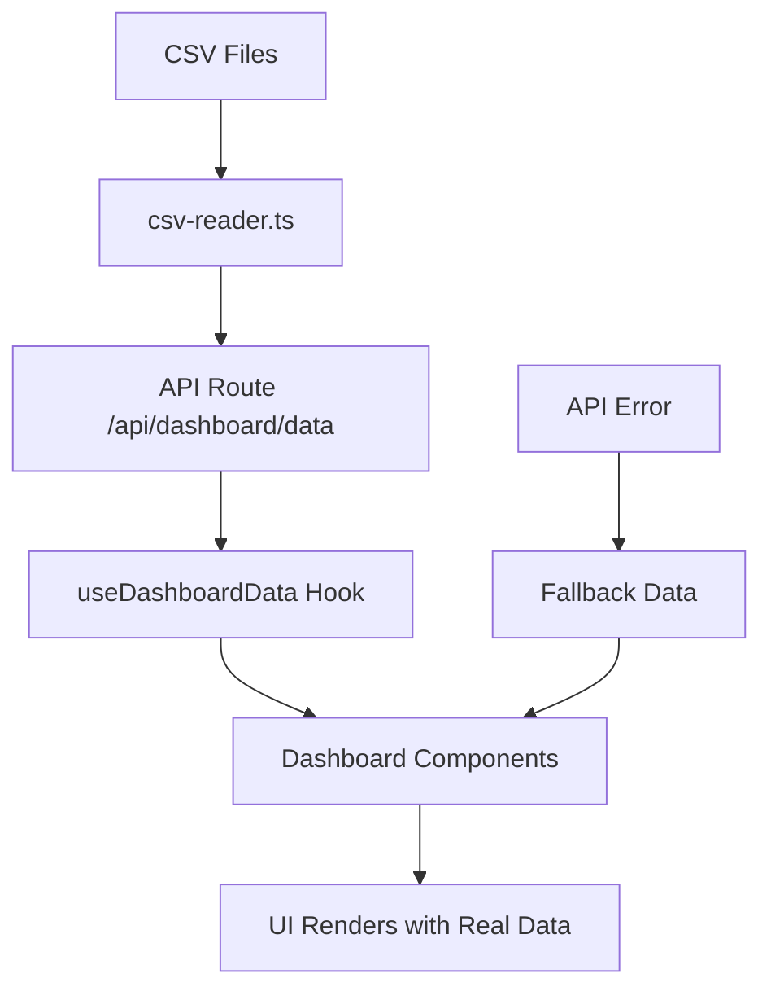

# Dynamic Dashboard Implementation

## Overview
The NPCL Dashboard has been successfully converted from static data to dynamic data sourced from CSV files in the `database/` directory. The implementation maintains **exact** card sizes, positions, and layout as documented in `UI.md`.

## 🎯 Key Features

### ✅ Dynamic Data Sources
- **Daily Metrics**: `database/daily_metrics.csv`
- **Language Statistics**: `database/language_statistics.csv`
- **Status Statistics**: `database/status_statistics.csv`
- **Call Records**: `database/call_records.csv`

### ✅ Layout Preservation
- **Exact same grid structure**: `grid-cols-1 md:grid-cols-2 lg:grid-cols-4`
- **Same card dimensions**: `h-32` for metrics cards
- **Same chart containers**: `h-full flex flex-col`
- **Same spacing**: `gap-4 mb-6`

### ✅ Fallback System
- If API fails, components use original static data
- No layout shifts or broken UI states
- Graceful error handling with retry options

## 📁 File Structure

```
lib/data/
├── csv-reader.ts           # CSV parsing utilities
└── test-csv-reader.ts      # Testing functions

app/api/
├── dashboard/data/route.ts # Main dashboard API
└── test-csv/route.ts       # CSV testing endpoint

hooks/
├── use-dashboard-data.ts   # Data fetching hook
└── use-auth.ts            # Authentication hook

components/
├── ui/LoadingSkeleton.tsx  # Loading states
└── voicebot/
    ├── CallsByLanguageChart.tsx  # Updated with dynamic data
    └── CallsByStatusPanel.tsx    # Updated with dynamic data
```

## 🔄 Data Flow



## 🚀 Usage

### Dashboard Page
The dashboard automatically fetches and displays real data:

```tsx
// app/dashboard/page.tsx
const { data, loading, error, refetch } = useDashboardData()
const dashboardData = data || fallbackDashboardData
```

### Components
All components accept dynamic data while maintaining fallbacks:

```tsx
// components/voicebot/CallsByLanguageChart.tsx
<CallsByLanguageChart 
  data={dashboardData.languageChartData} 
  loading={loading} 
/>
```

## 📊 Data Mapping

### Metrics Cards
| CSV Field | Display |
|-----------|---------|
| `total_calls` | Total Calls |
| `avg_duration_seconds` | Avg Duration (MM:SS) |
| `unique_languages` | Language Count |
| `docket_count` | Docket Count |
| `*_growth_percent` | Growth indicators |

### Language Chart
| CSV Field | Display |
|-----------|---------|
| `language` | Language name |
| `call_count` | Number of calls |
| Auto-assigned | Color coding |

### Status Panel
| CSV Field | Display |
|-----------|---------|
| `status` | Status name |
| `count` | Count value |
| Auto-assigned | Background/text colors |

## 🔧 API Endpoints

### Main Dashboard Data
```
GET /api/dashboard/data
```
Returns complete dashboard data including metrics, charts, and status information.

### CSV Test Endpoint
```
GET /api/test-csv
```
Tests CSV reading functionality and returns sample data.

## 🎨 UI Consistency

### Maintained Elements
- ✅ **Card sizes**: All metrics cards remain `h-32`
- ✅ **Grid layout**: `grid-cols-1 md:grid-cols-2 lg:grid-cols-4`
- ✅ **Chart containers**: Same height and flex properties
- ✅ **Spacing**: `gap-4 mb-6` preserved
- ✅ **Colors**: Same color scheme and styling
- ✅ **Typography**: Same font sizes and weights

### Enhanced Features
- 🔄 **Loading indicators**: Subtle spinners during data fetch
- ⚠️ **Error handling**: Clear error messages with retry options
- 📅 **Date range**: Dynamic date range from actual data
- 🕒 **Last updated**: Timestamp of data refresh
- 🔄 **Refresh button**: Click date range to refresh data

## 🧪 Testing

### Manual Testing
1. Visit `/api/test-csv` to verify CSV reading
2. Check browser console for CSV loading logs
3. Visit dashboard to see real data
4. Click date range button to refresh data

### Error Testing
1. Rename a CSV file to simulate missing data
2. Verify fallback data displays correctly
3. Check error messages appear appropriately

## 🔄 Data Updates

### Adding New Data
1. Update CSV files in `database/` directory
2. Data automatically refreshes on next API call
3. No code changes required for new data

### CSV Format Requirements
- First row must contain headers
- Date format: `YYYY-MM-DD`
- Numeric fields: Plain numbers (no commas)
- Text fields: Plain text (no special characters in CSV structure)

## 🚨 Troubleshooting

### Common Issues

#### CSV Not Loading
- Check file paths in `database/` directory
- Verify CSV format and headers
- Check server console for parsing errors

#### Layout Broken
- Verify fallback data is being used
- Check CSS classes match UI.md documentation
- Ensure grid structure is preserved

#### API Errors
- Check `/api/test-csv` endpoint first
- Verify file permissions on CSV files
- Check server logs for detailed errors

### Debug Steps
1. Open browser dev tools
2. Check Network tab for API calls
3. Check Console for error messages
4. Verify CSV files exist and are readable

## 📈 Performance

### Optimizations
- **Client-side caching**: Data cached until manual refresh
- **Fallback system**: No loading delays for UI
- **Minimal API calls**: Single endpoint for all dashboard data
- **Error boundaries**: Graceful degradation

### Loading States
- **Metrics cards**: Show loading spinners
- **Charts**: Display loading indicators
- **Status panel**: Maintain structure during load

## 🔮 Future Enhancements

### Potential Improvements
1. **Real-time updates**: WebSocket integration
2. **Date filtering**: Select specific date ranges
3. **Export functionality**: Download data as CSV/PDF
4. **Caching**: Redis or database caching
5. **Pagination**: For large datasets

### Scalability
- Current implementation handles thousands of records
- CSV parsing is efficient for moderate datasets
- Can be migrated to database when needed

---

## ✅ Implementation Complete

The dashboard is now fully dynamic while maintaining the exact UI layout and design specified in `UI.md`. All components gracefully handle data loading, errors, and fallbacks without disrupting the user experience.

**Key Achievement**: Zero layout displacement while adding full dynamic functionality.