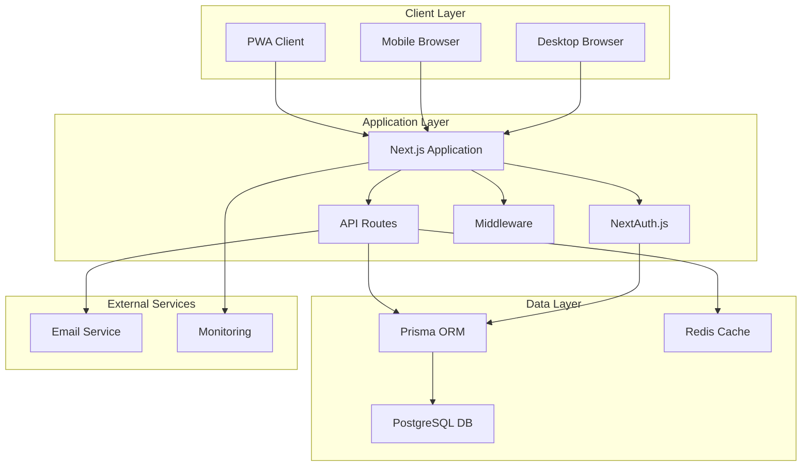
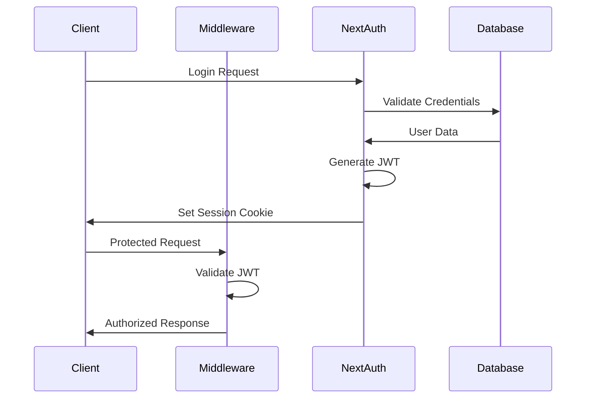
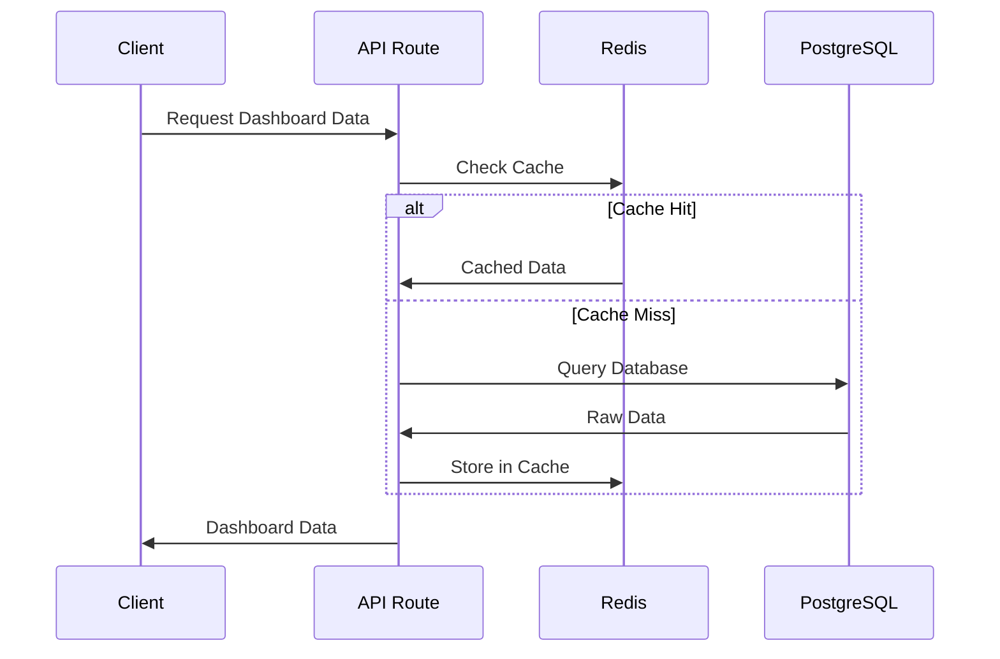
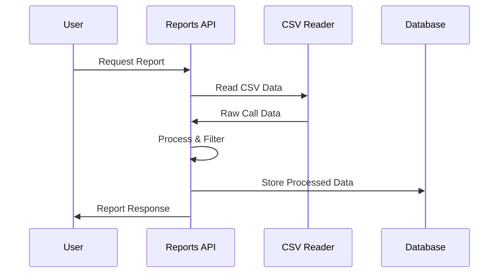
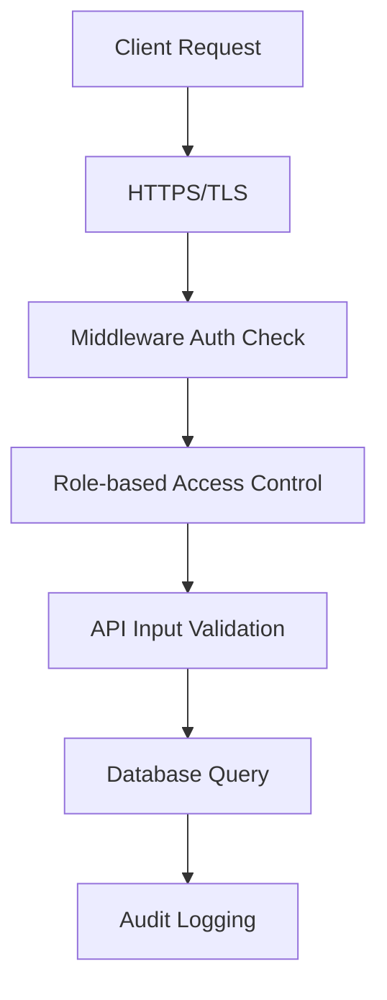
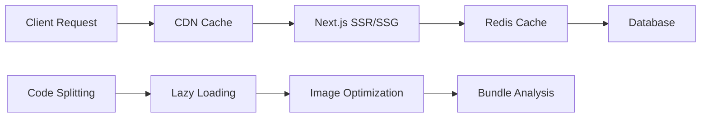
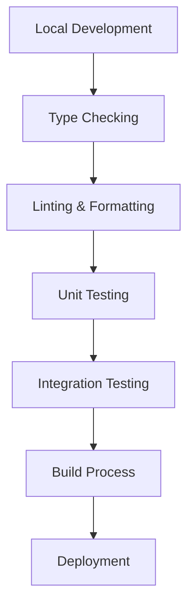
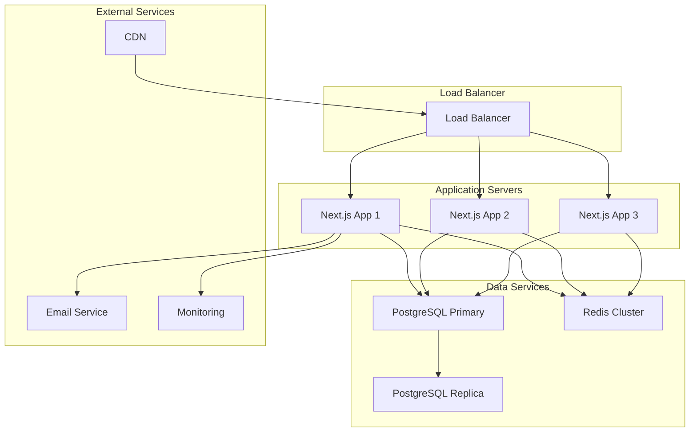

# System Architecture

This document provides a comprehensive overview of the NPCL Dashboard system architecture, including components, data flow, and design patterns.

## 🏗️ High-Level Architecture



## 🎯 Architecture Principles

### 1. **Separation of Concerns**
- Clear separation between presentation, business logic, and data layers
- Modular component architecture
- Single responsibility principle

### 2. **Scalability**
- Horizontal scaling capabilities
- Caching strategies for performance
- Stateless application design

### 3. **Security First**
- Authentication and authorization at every layer
- Input validation and sanitization
- Secure communication protocols

### 4. **Performance Optimization**
- Client-side and server-side caching
- Lazy loading and code splitting
- Optimized database queries

### 5. **Maintainability**
- Type-safe development with TypeScript
- Comprehensive testing strategy
- Clear documentation and code standards

## 🏢 System Components

### Frontend Layer

#### Next.js Application
```typescript
// App Router Structure
app/
├── layout.tsx          // Root layout with providers
├── page.tsx           // Landing page
├── auth/              // Authentication pages
├── dashboard/         // Dashboard pages
├── reports/           // Reports pages
├── settings/          // Settings pages
└── api/               // API routes
```

**Key Features:**
- Server-side rendering (SSR)
- Static site generation (SSG)
- Progressive Web App (PWA) capabilities
- Mobile-first responsive design

#### Component Architecture
```typescript
components/
├── auth/              // Authentication components
├── ui/                // Reusable UI components
├── layout/            // Layout components
├── reports/           // Report-specific components
├── voicebot/          // VoiceBot components
├── providers/         // Context providers
├── pwa/               // PWA components
└── performance/       // Performance optimization
```

### Backend Layer

#### API Routes
```typescript
app/api/
├── auth/              // Authentication endpoints
│   ├── [...nextauth]/ // NextAuth.js handler
│   ├── register/      // User registration
│   ├── profile/       // User profile
│   └── users/         // User management
├── dashboard/         // Dashboard data
│   ├── stats/         // Statistics
│   └── data/          // Dashboard data
├── reports/           // Reports API
│   ├── data/          // Report data
│   └── voicebot-calls/ // VoiceBot calls
└── settings/          // Settings API
```

#### Middleware Layer
```typescript
// Route Protection and RBAC
middleware.ts
├── Authentication validation
├── Role-based access control
├── Request/response headers
├── Performance optimization
└── Security headers
```

### Data Layer

#### Database Schema
```prisma
// Core Models
model User {
  id       String   @id @default(cuid())
  email    String   @unique
  name     String
  role     UserRole @default(VIEWER)
  // ... additional fields
}

model VoicebotCall {
  id                   String   @id @default(cuid())
  cli                  String
  receivedAt           DateTime
  language             String
  queryType            String
  // ... additional fields
}

model AuditLog {
  id        String   @id @default(cuid())
  userId    String?
  action    String
  resource  String
  details   Json?
  timestamp DateTime @default(now())
  // ... additional fields
}
```

#### Caching Strategy
```typescript
// Redis Caching Implementation
lib/cache/
├── redis.ts           // Redis client configuration
├── middleware.ts      // Cache middleware
├── helpers.ts         // Cache helper functions
└── keys.ts            // Cache key management
```

## 🔄 Data Flow Architecture

### Authentication Flow


### Dashboard Data Flow


### Report Generation Flow


## 🔐 Security Architecture

### Authentication & Authorization
```typescript
// Multi-layer Security
1. NextAuth.js JWT Strategy
2. Middleware Route Protection
3. API Route Validation
4. Database-level Permissions
5. Client-side Role Guards
```

### Security Layers


### Security Features
- **JWT Authentication**: Stateless token-based auth
- **Role-based Access Control**: Admin, Operator, Viewer roles
- **Input Validation**: Zod schema validation
- **SQL Injection Prevention**: Prisma ORM protection
- **XSS Protection**: Content Security Policy
- **CSRF Protection**: Built-in Next.js protection

## 📊 Performance Architecture

### Caching Strategy
```typescript
// Multi-level Caching
1. Browser Cache (Static Assets)
2. CDN Cache (Global Distribution)
3. Redis Cache (Application Data)
4. Database Query Cache
5. Component-level Memoization
```

### Performance Optimizations


### Performance Features
- **Server-side Rendering**: Fast initial page loads
- **Static Generation**: Pre-built pages for speed
- **Code Splitting**: Reduced bundle sizes
- **Image Optimization**: WebP/AVIF formats
- **Lazy Loading**: Components loaded on demand
- **Redis Caching**: Fast data retrieval

## 🔧 Development Architecture

### Development Workflow


### Build Process
```typescript
// Build Pipeline
1. TypeScript Compilation
2. ESLint Code Quality Check
3. Jest Unit Tests
4. Next.js Production Build
5. Docker Image Creation
6. Deployment to Platform
```

### Development Tools
- **TypeScript**: Type safety and IntelliSense
- **ESLint**: Code quality and consistency
- **Prettier**: Code formatting
- **Jest**: Unit and integration testing
- **Prisma Studio**: Database management
- **Docker**: Containerized development

## 🚀 Deployment Architecture

### Production Environment


### Deployment Options
1. **Vercel** (Recommended)
   - Automatic deployments
   - Global CDN
   - Serverless functions

2. **Docker + Cloud Provider**
   - AWS ECS/EKS
   - Google Cloud Run
   - Azure Container Instances

3. **Traditional VPS**
   - PM2 process management
   - Nginx reverse proxy
   - Manual scaling

## 📈 Monitoring & Observability

### Monitoring Stack
```typescript
// Monitoring Components
1. Application Performance Monitoring
2. Database Performance Metrics
3. Cache Hit/Miss Ratios
4. User Activity Tracking
5. Error Logging and Alerting
6. Security Event Monitoring
```

### Observability Features
- **Performance Metrics**: Web Vitals tracking
- **Error Monitoring**: Comprehensive error logging
- **Audit Logging**: Complete user activity tracking
- **Health Checks**: System status monitoring
- **Database Monitoring**: Query performance tracking

## 🔮 Scalability Considerations

### Horizontal Scaling
- Stateless application design
- Load balancer distribution
- Database read replicas
- Redis clustering

### Vertical Scaling
- Resource optimization
- Database indexing
- Query optimization
- Caching strategies

### Future Scalability
- Microservices architecture
- Event-driven architecture
- Message queues
- API gateway

---

This architecture provides a solid foundation for the NPCL Dashboard, ensuring scalability, security, and maintainability while delivering excellent performance and user experience.