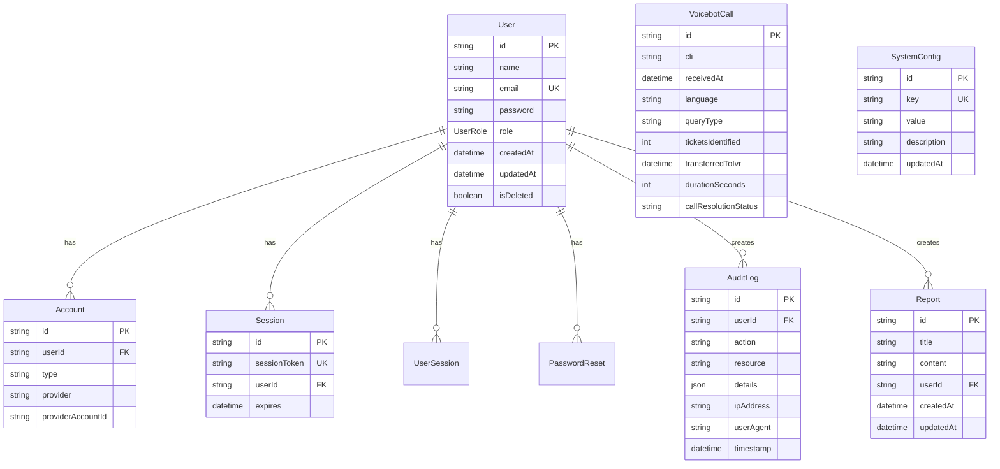

# Database Schema

This document provides a comprehensive overview of the NPCL Dashboard database schema, including table structures, relationships, and design decisions.

## 📊 Database Overview

The NPCL Dashboard uses **PostgreSQL** as the primary database (with SQLite for development) and **Prisma ORM** for type-safe database operations.

### Key Design Principles
- **Normalization**: Proper data normalization to reduce redundancy
- **Type Safety**: Strong typing with Prisma schema
- **Audit Trail**: Comprehensive logging for compliance
- **Performance**: Optimized indexes and queries
- **Scalability**: Designed for horizontal scaling

## 🗄️ Schema Overview



## 📋 Table Definitions

### User Management Tables

#### Users Table
```sql
CREATE TABLE users (
    id TEXT PRIMARY KEY,
    name TEXT NOT NULL,
    email TEXT UNIQUE NOT NULL,
    password TEXT NOT NULL,
    role TEXT NOT NULL DEFAULT 'VIEWER',
    created_at DATETIME DEFAULT CURRENT_TIMESTAMP,
    updated_at DATETIME DEFAULT CURRENT_TIMESTAMP,
    is_deleted BOOLEAN DEFAULT FALSE
);
```

**Purpose**: Core user information and authentication
**Indexes**: 
- Primary key on `id`
- Unique index on `email`
- Index on `role` for role-based queries

#### Accounts Table (NextAuth.js)
```sql
CREATE TABLE accounts (
    id TEXT PRIMARY KEY,
    user_id TEXT NOT NULL,
    type TEXT NOT NULL,
    provider TEXT NOT NULL,
    provider_account_id TEXT NOT NULL,
    refresh_token TEXT,
    access_token TEXT,
    expires_at INTEGER,
    token_type TEXT,
    scope TEXT,
    id_token TEXT,
    session_state TEXT,
    FOREIGN KEY (user_id) REFERENCES users(id) ON DELETE CASCADE,
    UNIQUE(provider, provider_account_id)
);
```

**Purpose**: OAuth provider account linking
**Indexes**:
- Primary key on `id`
- Foreign key on `user_id`
- Unique constraint on `provider` + `provider_account_id`

#### Sessions Table (NextAuth.js)
```sql
CREATE TABLE sessions (
    id TEXT PRIMARY KEY,
    session_token TEXT UNIQUE NOT NULL,
    user_id TEXT NOT NULL,
    expires DATETIME NOT NULL,
    FOREIGN KEY (user_id) REFERENCES users(id) ON DELETE CASCADE
);
```

**Purpose**: User session management
**Indexes**:
- Primary key on `id`
- Unique index on `session_token`
- Foreign key on `user_id`

#### User Sessions Table (Custom)
```sql
CREATE TABLE user_sessions (
    id TEXT PRIMARY KEY,
    user_id TEXT NOT NULL,
    token TEXT UNIQUE NOT NULL,
    expires_at DATETIME NOT NULL,
    created_at DATETIME DEFAULT CURRENT_TIMESTAMP,
    ip_address TEXT,
    user_agent TEXT,
    FOREIGN KEY (user_id) REFERENCES users(id) ON DELETE CASCADE
);
```

**Purpose**: Custom session tracking with metadata
**Indexes**:
- Primary key on `id`
- Unique index on `token`
- Foreign key on `user_id`
- Index on `expires_at` for cleanup

#### Password Resets Table
```sql
CREATE TABLE password_resets (
    id TEXT PRIMARY KEY,
    user_id TEXT NOT NULL,
    token TEXT UNIQUE NOT NULL,
    expires_at DATETIME NOT NULL,
    used BOOLEAN DEFAULT FALSE,
    created_at DATETIME DEFAULT CURRENT_TIMESTAMP,
    FOREIGN KEY (user_id) REFERENCES users(id) ON DELETE CASCADE
);
```

**Purpose**: Password reset token management
**Indexes**:
- Primary key on `id`
- Unique index on `token`
- Foreign key on `user_id`
- Index on `expires_at` for cleanup

### Application Data Tables

#### VoiceBot Calls Table
```sql
CREATE TABLE voicebot_calls (
    id TEXT PRIMARY KEY,
    cli TEXT NOT NULL,
    received_at DATETIME NOT NULL,
    language TEXT NOT NULL,
    query_type TEXT NOT NULL,
    tickets_identified INTEGER NOT NULL,
    transferred_to_ivr DATETIME,
    duration_seconds INTEGER NOT NULL,
    call_resolution_status TEXT,
    created_at DATETIME DEFAULT CURRENT_TIMESTAMP,
    updated_at DATETIME DEFAULT CURRENT_TIMESTAMP
);
```

**Purpose**: VoiceBot call records and analytics
**Indexes**:
- Primary key on `id`
- Index on `received_at` for date range queries
- Index on `language` for filtering
- Index on `call_resolution_status` for status filtering
- Composite index on `received_at` + `language` for common queries

#### Reports Table
```sql
CREATE TABLE reports (
    id TEXT PRIMARY KEY,
    title TEXT NOT NULL,
    content TEXT,
    user_id TEXT NOT NULL,
    created_at DATETIME DEFAULT CURRENT_TIMESTAMP,
    updated_at DATETIME DEFAULT CURRENT_TIMESTAMP,
    FOREIGN KEY (user_id) REFERENCES users(id) ON DELETE CASCADE
);
```

**Purpose**: Generated reports storage
**Indexes**:
- Primary key on `id`
- Foreign key on `user_id`
- Index on `created_at` for chronological queries

### System Tables

#### Audit Logs Table
```sql
CREATE TABLE audit_logs (
    id TEXT PRIMARY KEY,
    user_id TEXT,
    action TEXT NOT NULL,
    resource TEXT NOT NULL,
    details JSON,
    ip_address TEXT,
    user_agent TEXT,
    timestamp DATETIME DEFAULT CURRENT_TIMESTAMP,
    FOREIGN KEY (user_id) REFERENCES users(id)
);
```

**Purpose**: Complete audit trail for compliance
**Indexes**:
- Primary key on `id`
- Foreign key on `user_id`
- Index on `timestamp` for chronological queries
- Index on `action` for action-based filtering
- Index on `resource` for resource-based filtering
- Composite index on `user_id` + `timestamp`

#### System Configuration Table
```sql
CREATE TABLE system_config (
    id TEXT PRIMARY KEY,
    key TEXT UNIQUE NOT NULL,
    value TEXT NOT NULL,
    description TEXT,
    updated_at DATETIME DEFAULT CURRENT_TIMESTAMP
);
```

**Purpose**: Application configuration storage
**Indexes**:
- Primary key on `id`
- Unique index on `key`

#### Verification Tokens Table (NextAuth.js)
```sql
CREATE TABLE verification_tokens (
    identifier TEXT NOT NULL,
    token TEXT UNIQUE NOT NULL,
    expires DATETIME NOT NULL,
    UNIQUE(identifier, token)
);
```

**Purpose**: Email verification and magic links
**Indexes**:
- Unique index on `token`
- Unique constraint on `identifier` + `token`

## 🔗 Relationships

### User Relationships
```typescript
// User has many relationships
User 1:N Account
User 1:N Session
User 1:N UserSession
User 1:N PasswordReset
User 1:N AuditLog
User 1:N Report
```

### Data Integrity
- **Cascade Deletes**: User deletion cascades to related records
- **Foreign Key Constraints**: Maintain referential integrity
- **Unique Constraints**: Prevent duplicate data
- **Check Constraints**: Validate data at database level

## 📊 Enums and Types

### User Role Enum
```typescript
enum UserRole {
  ADMIN = 'ADMIN',
  OPERATOR = 'OPERATOR',
  VIEWER = 'VIEWER'
}
```

### Equipment Status Enum
```typescript
enum EquipmentStatus {
  ONLINE = 'ONLINE',
  OFFLINE = 'OFFLINE',
  MAINTENANCE = 'MAINTENANCE',
  ERROR = 'ERROR'
}
```

## 🔍 Query Patterns

### Common Query Examples

#### User Authentication
```sql
-- Find user by email for login
SELECT id, name, email, password, role, is_deleted
FROM users 
WHERE email = ? AND is_deleted = FALSE;

-- Create audit log for login
INSERT INTO audit_logs (user_id, action, resource, details, ip_address, timestamp)
VALUES (?, 'login', 'auth', ?, ?, CURRENT_TIMESTAMP);
```

#### Dashboard Statistics
```sql
-- Get user count
SELECT COUNT(*) FROM users WHERE is_deleted = FALSE;

-- Get recent voicebot calls
SELECT COUNT(*) FROM voicebot_calls 
WHERE received_at >= ? AND received_at <= ?;

-- Get calls by language
SELECT language, COUNT(*) as count
FROM voicebot_calls 
WHERE received_at >= ? AND received_at <= ?
GROUP BY language
ORDER BY count DESC;
```

#### Report Generation
```sql
-- Get filtered voicebot calls
SELECT * FROM voicebot_calls
WHERE received_at BETWEEN ? AND ?
  AND language = COALESCE(?, language)
  AND call_resolution_status = COALESCE(?, call_resolution_status)
ORDER BY received_at DESC
LIMIT ? OFFSET ?;
```

## 🚀 Performance Optimizations

### Indexing Strategy
```sql
-- Primary indexes (automatic)
CREATE INDEX idx_users_email ON users(email);
CREATE INDEX idx_sessions_token ON sessions(session_token);

-- Performance indexes
CREATE INDEX idx_voicebot_calls_received_at ON voicebot_calls(received_at);
CREATE INDEX idx_voicebot_calls_language ON voicebot_calls(language);
CREATE INDEX idx_audit_logs_timestamp ON audit_logs(timestamp);
CREATE INDEX idx_audit_logs_user_id ON audit_logs(user_id);

-- Composite indexes for common queries
CREATE INDEX idx_voicebot_calls_date_language ON voicebot_calls(received_at, language);
CREATE INDEX idx_audit_logs_user_timestamp ON audit_logs(user_id, timestamp);
```

### Query Optimization
- **Selective Queries**: Only fetch required columns
- **Pagination**: Use LIMIT/OFFSET for large datasets
- **Date Range Queries**: Optimize with proper indexes
- **Aggregation**: Use database-level aggregation when possible

## 🔧 Migration Strategy

### Prisma Migrations
```bash
# Generate migration
npx prisma migrate dev --name add_new_feature

# Apply migrations
npx prisma migrate deploy

# Reset database (development only)
npx prisma migrate reset
```

### Migration Best Practices
- **Backward Compatibility**: Ensure migrations don't break existing code
- **Data Preservation**: Always backup before major migrations
- **Testing**: Test migrations on staging environment first
- **Rollback Plan**: Have rollback strategy for failed migrations

## 📈 Scaling Considerations

### Read Replicas
```typescript
// Database connection configuration
const readReplica = new PrismaClient({
  datasources: {
    db: {
      url: process.env.DATABASE_READ_URL
    }
  }
})

// Use read replica for queries
const stats = await readReplica.voicebotCall.count()
```

### Partitioning Strategy
```sql
-- Partition audit logs by date
CREATE TABLE audit_logs_2024_01 PARTITION OF audit_logs
FOR VALUES FROM ('2024-01-01') TO ('2024-02-01');

CREATE TABLE audit_logs_2024_02 PARTITION OF audit_logs
FOR VALUES FROM ('2024-02-01') TO ('2024-03-01');
```

### Archival Strategy
```sql
-- Archive old audit logs
CREATE TABLE audit_logs_archive AS
SELECT * FROM audit_logs 
WHERE timestamp < NOW() - INTERVAL '1 year';

DELETE FROM audit_logs 
WHERE timestamp < NOW() - INTERVAL '1 year';
```

## 🔒 Security Considerations

### Data Protection
- **Password Hashing**: bcrypt with salt rounds
- **Sensitive Data**: Encrypt PII at application level
- **Access Control**: Row-level security where needed
- **Audit Trail**: Complete activity logging

### Backup Strategy
```bash
# Daily backup
pg_dump -h localhost -U postgres npcl_dashboard > backup_$(date +%Y%m%d).sql

# Point-in-time recovery
pg_basebackup -h localhost -D /backup/base -U postgres -v -P -W
```

## 📊 Monitoring

### Database Metrics
- **Connection Pool**: Monitor active connections
- **Query Performance**: Track slow queries
- **Index Usage**: Monitor index effectiveness
- **Storage Growth**: Track database size

### Health Checks
```sql
-- Database health check
SELECT 
  schemaname,
  tablename,
  attname,
  n_distinct,
  correlation
FROM pg_stats
WHERE schemaname = 'public';
```

---

This database schema provides a solid foundation for the NPCL Dashboard, ensuring data integrity, performance, and scalability while maintaining security and compliance requirements.